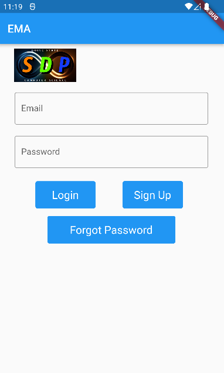
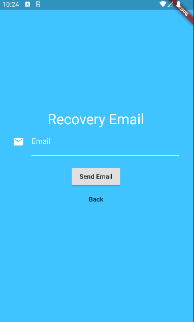
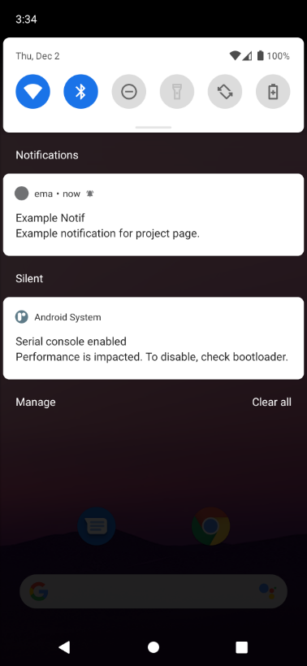
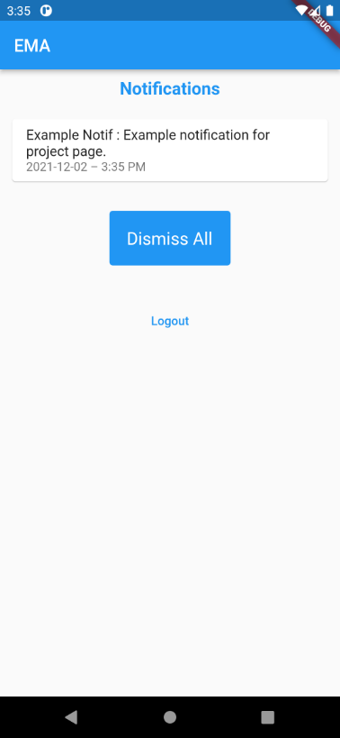
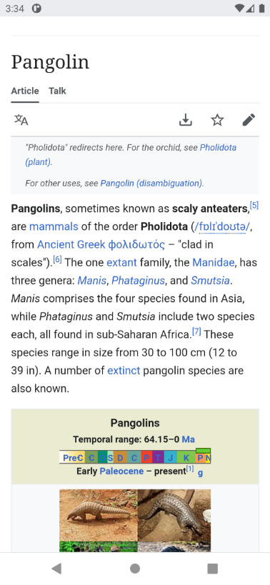
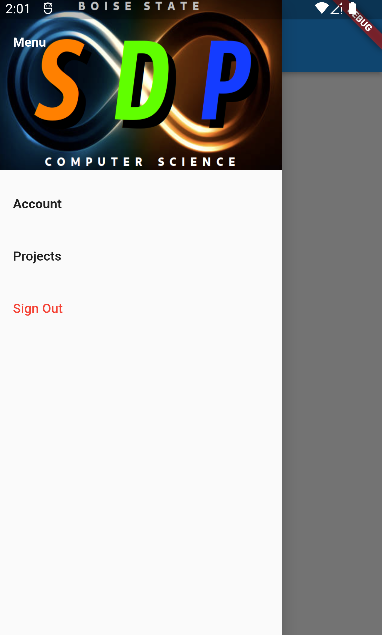
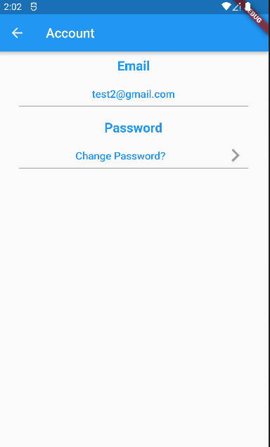
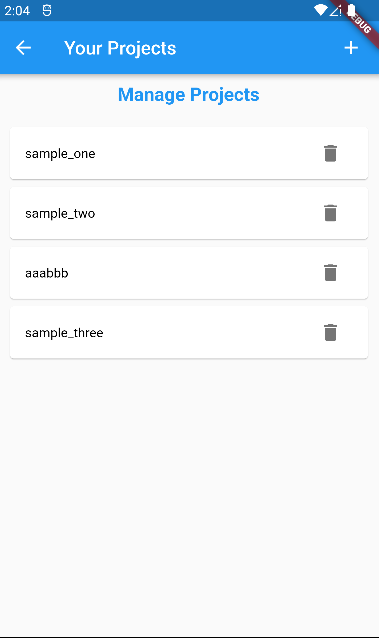

# Ecological Momentary Assessment (EMA) App

## Creators: 

**Mobile App:** Paisley Davis, Chloe Johnson, Mason Humpherys, Jeff Kahn, Jason Kuphaldt, Jonathon Tipton  

**Web Console:** Andrew Haddon, Alejandro Macias, Daniel Rao, Brandon Boys

## Abstract:

Ecological Momentary Assessment (EMA) is a data collection approach which requires participants to answer very brief surveys at specific moments in their daily lives. The goal of this project is to create a mobile app that will make the survey collection process easier and more efficient for both researchers and participants. 

Our app is meant to act as an interface between surveys hosted on Qualtrics and participants' smartphones. It facilitates the collection of EMA data while providing customization options for both parties, such as researcher-scheduled reminders and a visual streak system that provides psychological rewards for completing surveys. We hope this app can improve the survey-taking process, both increasing participants’ satisfaction with it and the quantity and quality of the data collected.  
  
This app is currently a work-in-progress and does not fulfill all necessary functionality.

The web console is meant to act as a web interface to allow a single admin user to manage projects. The console has a friendly login page to log in and a reset password page to update password when necessary. The management of projects consists of creating new projects and editing existing projects. The console contains a feature to create new reminders for existing projects. When the admin user logs in, they will land on the dashboard page which contains general information about projects, participants, and reminders for the admin user to analyze.

## Project Description:

### Mobile

Our app is built using [Flutter](https://flutter.dev/). Using flutter we have updated the compatibility of he app to now work with IoS when it previously only worked on Android. Administrative actions on the mobile application have been furloughed in favor of providing said functions on the web console.
Users of the app are able to create accounts on the mobile application, reset their password if forgotten, view their streak of participation, receive notifications containing survey links that display their expiration times that are automatically removed upon expiration.  Users are also able to leave projects that they have been added to as well as change their password and view more information about the SDP process through a dialogue notification that appears when the SDP logo is tapped.
  
Login screen as viewed upon opening app for the first time:  

  
  
The app also has persistent login capabilities, so users only have to login once per device. 

In the event that the user forgets their password, they can use the forgot password button on the login screen to be redirected to a new page where upon entering their email registered with the account, they will be emailed a link that allows the user to change their password

If the app is closed or in the background, the notification will appear as a regular push notification.   
  

If the app is open and logged into a regular user account, the notification will appear in the notification list on the main screen.   
  

Selecting either notifications will open the notification's containing link in the device's default browser. 

Users that are logged in have access to a sidebar that contains Account and Project information as well as a sign out option

The account option takes the user to a new screen where they are able to view their registered email and change their password

The project information option allows users to see the list of projects that they are subscribed to and unsubscribe

